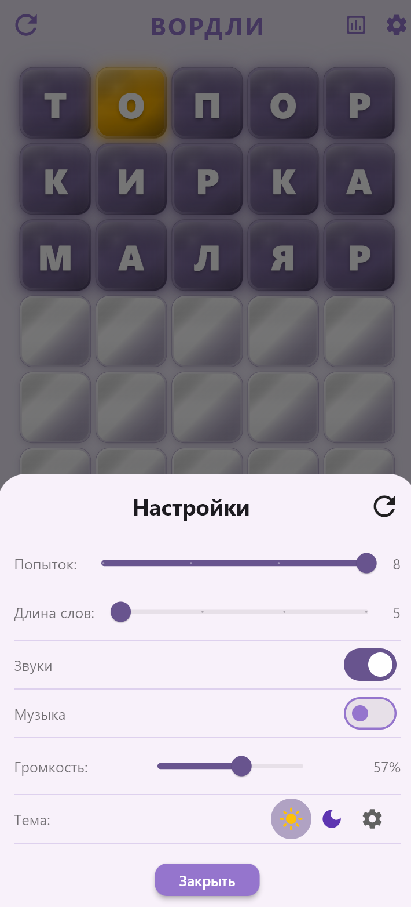
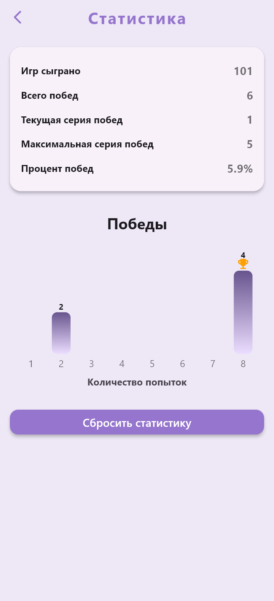
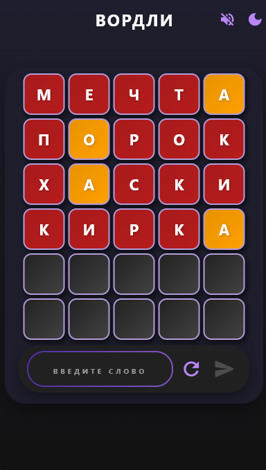
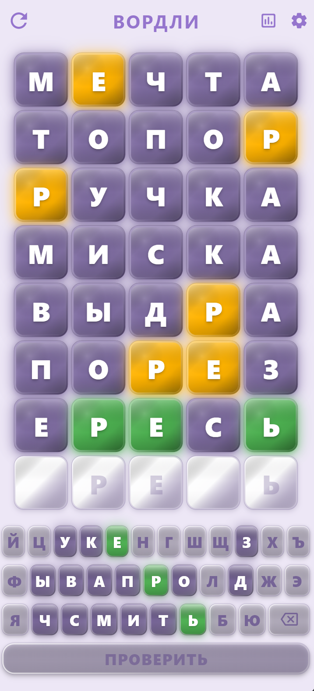

# Wordle

## A Wordle clone made with Flutter.

## Features
- 6 attempts to guess a 5-letter word
- Hints after each guess (green for correct letter and position, yellow for correct letter but wrong position, red for incorrect letter)
- Responsive design for different screen sizes
- Light and dark themes
- Sound effects

## How to Run
1. Make sure you have Flutter installed on your machine. If you don't have it, follow the instructions on the [Flutter website](https://flutter.dev/docs/get-started/install).
2. Clone this repository:
    ```
    git clone
    ```
3. Navigate to the project directory:
    ```
    cd wordle_flutter_app
    ``` 
4. Get the dependencies:
    ```
    flutter pub get
    ```
5. Run the app:
    ```
    flutter run
    ```

## Screenshots






## License
This project is licensed under the MIT License - see the [LICENSE](LICENSE) file for details
